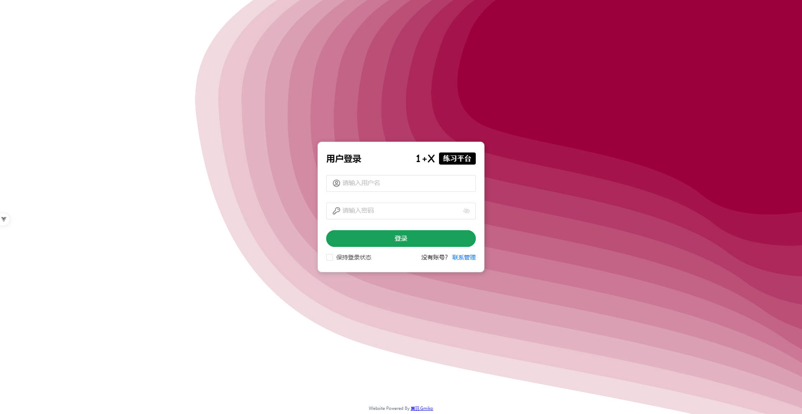
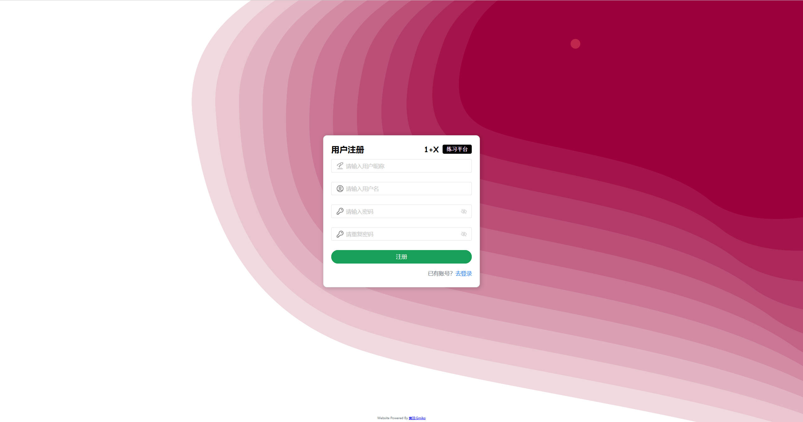
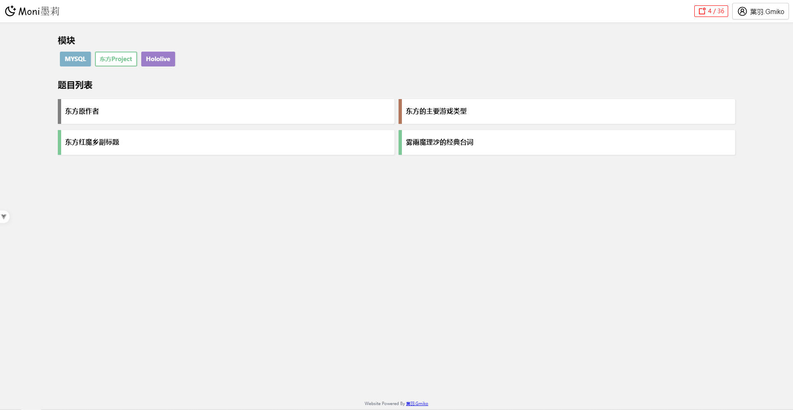
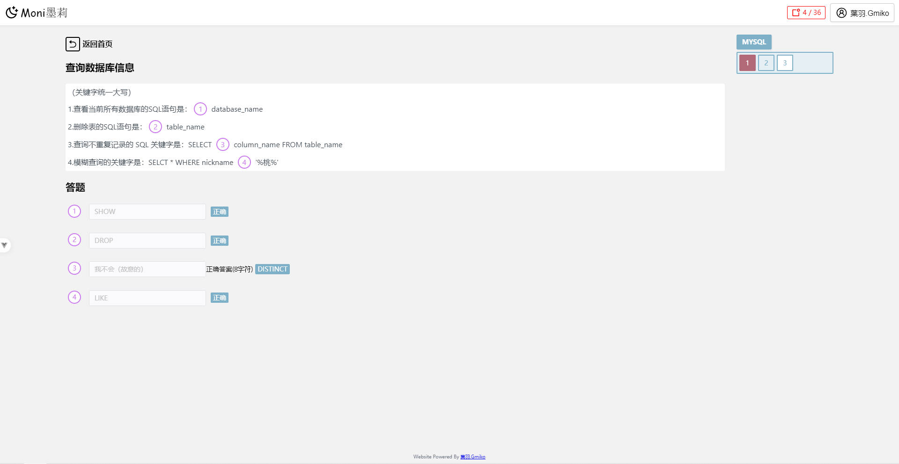
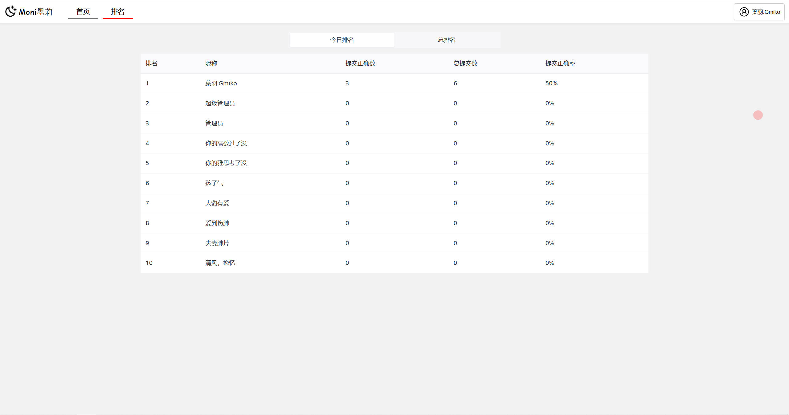
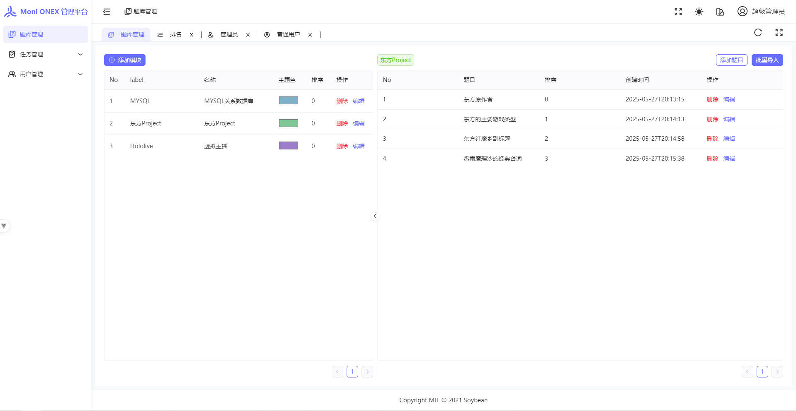
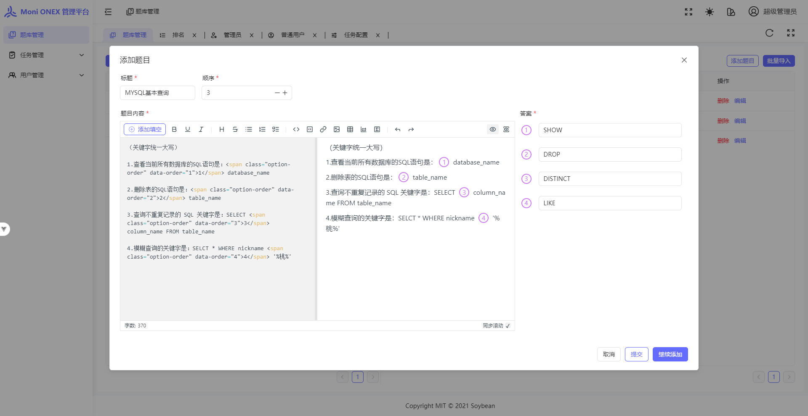
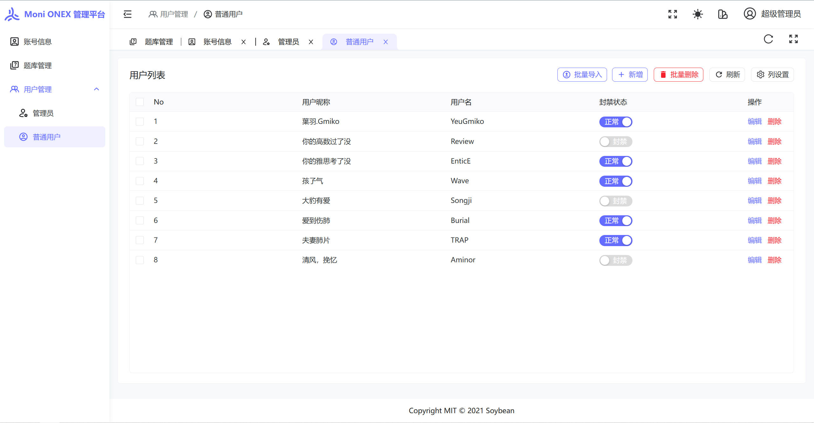
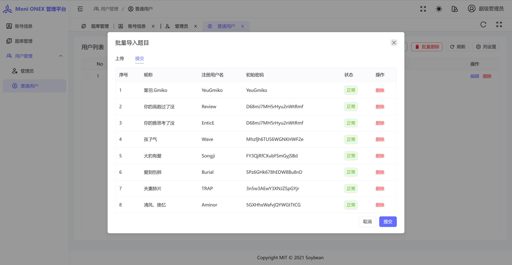

# Moni ONEX 刷题平台

ONEX是一个web应用，起初用于给老师为学生备考，所做的刷题系统。里面有最基础的刷题功能，并且只需要纯文本形式，就可以进行普通用户（学生）和题目的批量导入。

# 特色

- 模块和题目管理
- 每日排名和总排名
- 题目和学生的批量导入（纯文本）

# 截图（用户端）

**登录页面**

> 在管理端导入学生账号信息后，学生方可进行用户端的登录和注册

**首页**

> 里面的题目依据模块来进行划分，学生可自行挑选模块进行刷题

**答题页**

> 里面的题目内容格式是markdown，想要更丰富的题目内容也可以在管理端进行手动添加

**用户排名**

> 用户可以查看所有用户的每日排名和总排名

# 截图（管理端）

**题库管理**

> 老师可以进行模块、题目的添加，以及设置各个模块的主题色（建议为深色），让页面不再单调，让学生能够更明显感知模块信息

**添加题目**

> 题目内容语法为markdown，不过暂不支持mermaid语法，选项内容暂只有“填空”

**用户管理**

> 超管和管理员可以管理下级的用户

> 也可以按照模板进行批量导入（有样例文件）

# 开发建议

如果你是一位开发者，你可能需要知道启动该项目的一些技术栈

| 用户前台 | 版本  | 用户后台 | 版本       | 后端       | 版本   |
| -------- | ----- | -------- | ---------- | ---------- | ------ |
| VueJS    | 3.5.x | node     | >= 18.12.0 | JavaJDK    | 21     |
| Vite     | 5.4.x | pnpm     | >= 8.7.0   | KotlinJVM  | 2.1.20 |
|          |       | VueJS    | 3.5.x      | SpringBoot | 3.4.x  |
|          |       | Vite     | 6.0.x      |            |        |

如果你想使用docker容器来进行快速构建，抱歉我还没学会（苦笑），辛苦自己弄一下吧
